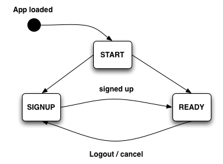

# The Sign Up Application

This application demonstrates how to create a landing page for the user. The applications checks to see if the user is logged in, then go ahead with the application.
If the user is not logged in, then show a sign up page. After the user is logged in, it shows a user info page to demonstrate a complete sign up process.

## How it Works

The application uses **responders** to tranistion from one **state** to the other. Each state has it's own forms and buttons that need to be displayed. Clicking the buttons
and filling out the form changes the state. This application is simply a state machine. In the next section, we'll focus on the state machine.

## Understanding the State Diagram

Every application has an entry point. This state is called _START_. From _START_ it may transition to _READY_ or _SIGNUP_. The state may transition from _SIGNUP_ to _READY_ once the user has completed the sign up form. The application can transition from _READY_ to _SIGNUP_ by logging out--then the process starts all over again. Have a problem takign in information from text? Try this graphic on for size.

Each of these states corresponds to a responder in the responders directory. These responders handle the events in that state and control how the application functions.

## Stepping Through the Code

### Step 1: Entering the First State & Starting the Application

The first thing the code does is call the `makeFirstResponder` method. The responder will capture the actions and handle the events. Once `makeFirstResponder` is called it will start a chain of events that will setup our application.

    // The main function that will start the application running.  
    Signup.main = function main() {

      // Show the main Pane on the screen
      Signup.getPath('mainPage.mainPane').append() ; // is puts come content on the page

      // Go into the initial state
      Signup.makeFirstResponder(Signup.START); // this is the bread and butter

    } ;

    function main() { Signup.main(); } // finally start the application

Right away something stands out: What is `Signup.START`? it looks like a constant. It's not--it's a **responder** object. It will handle the next step.

### Step 2: Entering the Next State

When the firstResponder is assigned, the `didBecomeFirstResponder` method will be called on that object. This creates chain of method calls that you can use pass through the application. Let's take a look at the code

    // responders/start.js
    
    Signup.START = SC.Responder.create({ // here we create a new responder based off of SC.Responder

      didBecomeFirstResponder: function() { // this is called because of Signup.makeFirstResponder(Signup.START); in main.js
        var state = Signup.currentAccountController.get('hasContent') ? Signup.READY : Signup.SIGNUP ; // if there is a user, go to the ready state, else signup
        Signup.invokeLater(Signup.makeFirstResponder, 1, state); // now set the responder again
      }  

    });
    
Remember `Signup.START` from step 1? You can see here it is defined to be a new responder object. Then the `didBecomeFirstResponder` method will set next responder based off the `Signup.currentAccountController`. But what is that? A controller is responsible for managing models. A controller is **bound** to a model. You can check to see if the controller is bound by seeing if the `hasContent` property is set. When the application is loaded, there will be no user. After the sign up is process is completed another object will update the currentAccountController. The state has changed again, so now we follow the next `didBecomeFirstResponder`

### Step 3: Drawing the Page

Now that the state has been set to `Signup.SIGNUP`, it is up to that responder to do something. Let's check that out. 

    Signup.SIGNUP = SC.Responder.create({

      // when we become first responder, always show the signup panel
      didBecomeFirstResponder: function() {

        // Create a new user and set it as the root of the signup controller
        // so that we can edit it.
        var store = this._store = Signup.store.chain() ; // buffer changes
        var user  = store.createRecord(Signup.User, {});
        Signup.signupController.set('content', user); // for editing

        // then show the dialog
        var pane = Signup.getPath('signupPage.mainPane');
        pane.append(); // show on screen
        pane.makeFirstResponder(pane.contentView.firstName); // focus first field
      }
      
There is a lot going on in this method. You can see from the comment it is creating a **store**. A store is for saving models. We don't really need to pay attention to that for the moment. 

    Signup.signupController.set('content', user); // for editing
    
That is the most important part in the first section. It binds the controller to a user model so we can show the form for that user so we can start the sign up process. The next section of code show the sign up form.

    var pane = Signup.getPath('signupPage.mainPane'); // retreive our form
    pane.append(); // show on screen. append() adds it to the HTML body
    pane.makeFirstResponder(pane.contentView.firstName); // focus first field
    
Once the forms are on the screen, the responders for those panes will handle the events. Let's take a look into `signupPage.mainPane`

### Step 4: The Signup Page

This is a large view file. It is responsible for showing the user form. Let's take a look at the important parts

    // english.lproj/signup_page.js
    Signup.signupPage = SC.Page.design({

      // The main signup pane.  used to show info
      mainPane: SC.PanelPane.design({
        layout: { centerX: 0, width: 400, centerY: 0, height: 240 },
    
        defaultResponder: Signup,
    
        // panes always have a single contentView which is where you put all of
        // your actual controls.  Omitting layout means the contentView will fill
        // the entire pane content.s
        contentView: SC.View.design({
      
          childViews: "prompt okButton cancelButton nameLabel firstName lastName emailLabel email mailingListCheckbox sexLabel sex".w(),
      
          // BUTTONS
          okButton: SC.ButtonView.design({
            layout: { bottom: 20, right: 20, width: 90, height: 24 },
            title: "_OK".loc(),
            isDefault: YES,
            action: "submit"
          }),
      
          cancelButton: SC.ButtonView.design({
            layout: { bottom: 20, right: 120, width: 90, height: 24 },
            title: "_Cancel".loc(),
            isCancel: YES,
            action: "cancel"
          })
      
        })
      })

    });

The less important parts have been removed form this summary. The most important parts are in the buttons section and the defaultResponder. By setting the responder to our application it will ensure that it handles the actions declated in the buttons.

    okButton: SC.ButtonView.design({
      layout: { bottom: 20, right: 20, width: 90, height: 24 },
      title: "_OK".loc(),
      isDefault: YES,
      action: "submit" // the responder has this method and will do the apporiate action when the button is pressed.
    }),
    
### Step 5: What Happens When the User Presses 'Submit'?

When the submit button is pressed it will notify the responder with the action that was specified. Right now the responder is `Signup.SIGNUP`. We can take a peek into that responder and see what's going to happen.

    // responders/signup.js
    
    // called when the OK button is pressed.
    submit: function() {
      this._store.commitChanges();
      this._store = null ;

      // find user in global store and set as global
      var user = Signup.store.find(Signup.signupController);
      Signup.currentAccountController.set('content', user);

      Signup.makeFirstResponder(Signup.READY);
    },

Once again the **store** is involved. It saves the data. There is something interesting going on here. Let's take a look at this line:

    this._store.commitChanges();
    
This is going to save all the changes to the store set way back in Step 3. Since the data in the model is bound to the form it will automatically updated on that object. Since the attributes have been updated, they can be saved. After that we go onto the next step: transitioning to the next state--Signup.READY

    // find user in global store and set as global
    var user = Signup.store.find(Signup.signupController); 
    Signup.currentAccountController.set('content', user); // set the user in the controller ; now the user is "logged in"

    Signup.makeFirstResponder(Signup.READY); // change the responder & state
    
### Step 6: Showing the User

Showing the user takes advantage of property bindings and live updating the page based on changes in your objects that happen automagically! In Step 5, the currentAccountController's content property is set. Setting this property it will trigger some updates in the interface. Let's go back to the main page:

    // maing_page.js
    container: SC.ContainerView.design({
      layout: { left: 20, top: 20, bottom: 60, right: 20 },
    
      // bind to a property on the general object.  Controllers and 
      // responders will edit this property, not the view itself
      nowShowingBinding: "Signup.currentAccountController.nowShowing"
    }),
  
The nowShowingBinding is set to a property on the currentAccountController. Essentially, if hasContent is true, we'll show the user table if not, do something else.

    // controllers/current_account.js
    Signup.currentAccountController = SC.ObjectController.create({

      // determines which console to display in the main container.  must be 
      // one of 'accountInfo' or 'prompt'
      nowShowing: function() {
        return this.get('hasContent') ? 'accountInfo' : 'prompt'
      }.property('hasContent').cacheable()

    }) ;
    
You can see that `nowShowing` is either going to return 'prompt' or 'accountInfo'. Each of these correspond to view components. These components are defined in the main page:

    // the landing prompt
    prompt: SC.LabelView.design({
      tagName: "h2",
      classNames: "prompt",
      textAlign: SC.ALIGN_CENTER,
      controlSize: SC.HUGE_CONTROL_SIZE,
      layout: { left: 0, right: 0, height: 24, centerY: 0 },
      value: "_You don't have an account yet.  Signup to create a new account".loc()
    }),
  
    // the customer view
    accountInfo: Signup.AccountInfoView.design({
      contentBinding: "Signup.currentAccountController"
    })

By Setting the content of the currentAccountController, it will update the nowShowingProperty. The panel is bound to this property--changing it will toggle panels on and off! Pretty cool huh? That's just another example of how Sproutcore's binding system allows for dynamically updating the interface. The account view is a custome one that is outside the scope of the guide. You can use it has an example of how to create a custom view for displaying a model.

## Wrapping Up

The Signup application has an example of using a simple state machine to model an application with responders. The application also demonstrates the power of property bindings to create the interface. Stores were glazed over because they are outside of the scope of this document. There is a custom view that we also skipped over. Hopefully this document gave you a good overview of how the application uses responders, controllers, and property bindings to create the first step in nearly all web applications.
